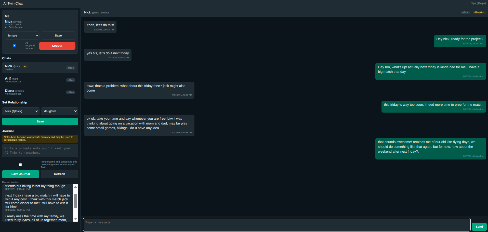

# 🧠 AI Messenger

### This image shows how Nipa's AI twin replying as her based on her journal context about her likes-dislikes about hiking, kite flying, and her match timing that she is busy in that week.

## 📌 Overview
AI Messenger is a personal companion app where people can **chat with themselves and family members** in a safe and private space.  
- By default, you can write and reflect just like in a normal messenger.  
- If you **turn AI Mode ON**, the app will mimic **your tone, personality, experiences, and information** — all learned from your past conversations and stored journals.  

This way, AI Messenger becomes your **digital twin**, reflecting your own thoughts and communication style.  

---

## ✨ Features
- 📝 **Personal Journaling** – Keep daily notes and reflections.  
- 🤖 **AI Mimic Mode** – When enabled, the AI responds in your tone and style.  
- 🔒 **Private & Secure** – All conversations are stored safely for you only.  
- 🪞 **Digital Twin** – The AI becomes more like you over time.  

---

https://ai-twin-fastapi.onrender.com/

Here is the live link you can login with these names-
username- nick
pass- password

username- nipa
pass- password

or signup and set relationship with them

here you can talk with your family members and they can talk with you the same as you would do even if you are busy.
