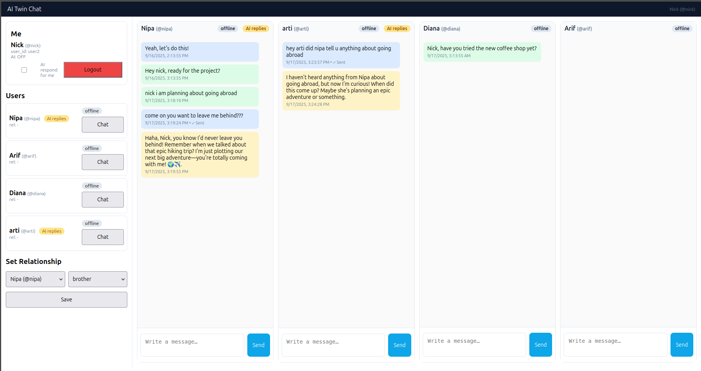

# 🧠 AI Messenger

## 📌 Overview
AI Messenger is a personal companion app where people can **chat with themselves** in a safe and private space.  
- By default, you can write and reflect just like in a normal messenger.  
- If you **turn AI Mode ON**, the app will mimic **your tone, personality, experiences, and information** — all learned from your past conversations and stored journals.  

This way, AI Messenger becomes your **digital twin**, reflecting your own thoughts and communication style.  

---

## ✨ Features
- 📝 **Personal Journaling** – Keep daily notes and reflections.  
- 🤖 **AI Mimic Mode** – When enabled, the AI responds in your tone and style.  
- 🔒 **Private & Secure** – All conversations are stored safely for you only.  
- 🪞 **Digital Twin** – The AI becomes more like you over time.  

---

